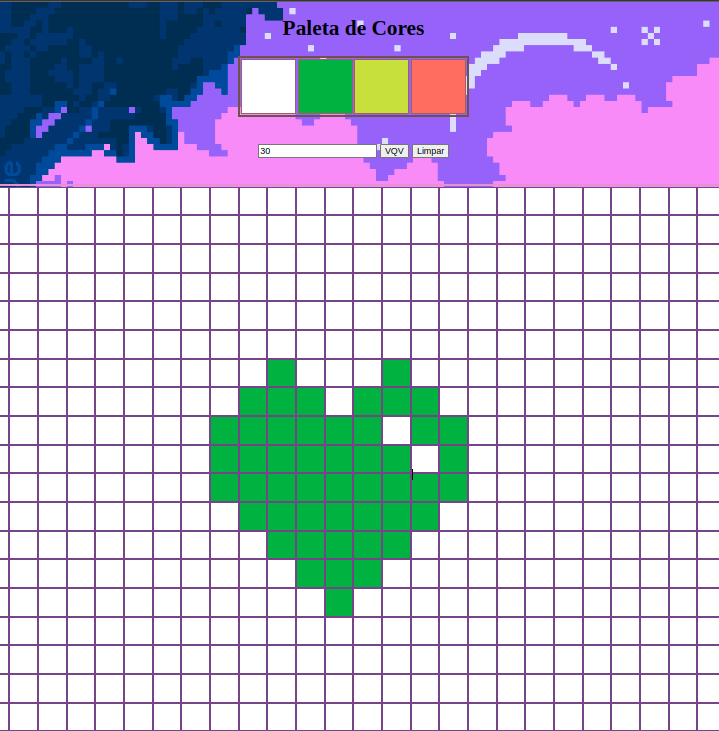

# Projeto Pixel's Art!

Boas-vindas, neste projeto de avaliação prática, utilizei todo o conhecimento adquirido na seção 5 do curso de Desenvolvimento Web da Trybe.
Esse projeto se trata de uma página onde é possível criar artes em pixeis de vários tamanhos.



## Ferramentas


---

## Habilidades

- Manipular o DOM.
- Manipular o Javascript.

---

# 🔨 Funcionalidades do projeto
É uma pagina web, com `3` partes importantes na tela, sendo as `4 paletas` de cores, uma sendo a cor "preta" fixa, e as demais são cores rgb's aleatórias, outra parte são os `botões` um para limpar tudo e outro para mudar o tamanho do quado, e a última parte é o `quado de pixel's`, que é possível pintalo, de acordo com a cor selecionado na paleta.

</br>


## 📁 Acesso ao projeto

clone este repositório:

```sh
git clone 
```

acesse o repositório clonado

```sh
cd pixels-art
```

Instale as dependências

```sh
npm install
```

</br>

vc pode usar a extensão do VsCode [LiveServer](https://github.com/ritwickdey/vscode-live-server) para executar o `index.HTML` em um navegador.

---

## Entrega
  - `3` dias de projeto.
  - Data do ultimo commit durante o desenvolvimento do projeto: `22/03/22`.
